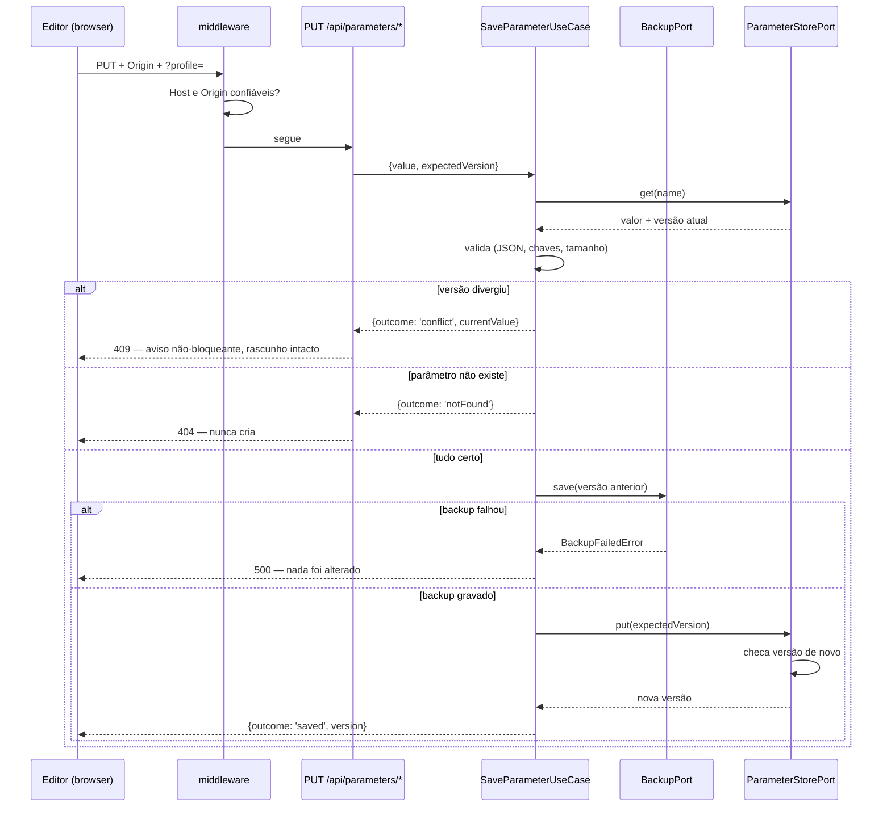
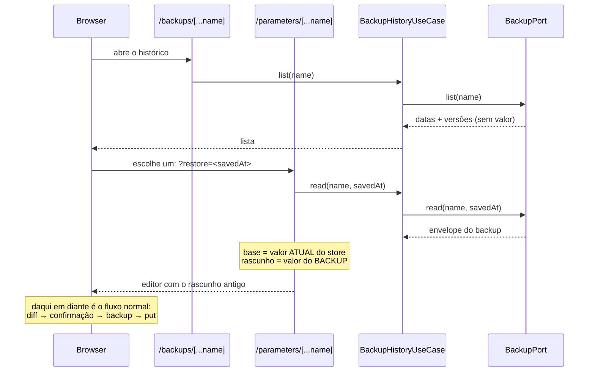
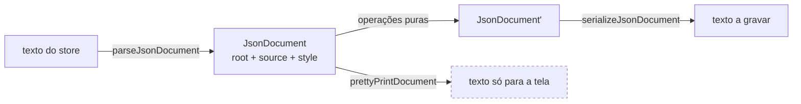
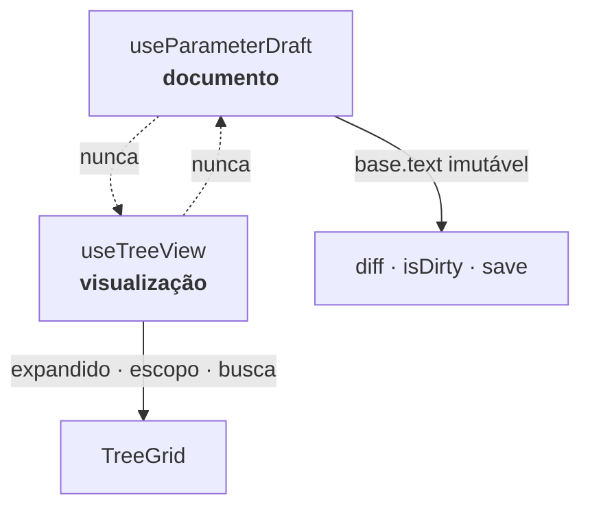

# Arquitetura

MVC no nível da aplicação, com o acesso ao store e à autenticação isolados por
**Ports & Adapters**. A regra que sustenta tudo: `application/` e `domain/` não
conhecem nenhum tipo do SDK da AWS.

## Camadas

```mermaid
flowchart TB
  subgraph browser["Browser (loopback)"]
    island["Ilhas React<br/>editor, seletor de profile"]
  end

%% A tela de backups é .astro puro: lista datas e versões, sem ilha.

  subgraph server["Servidor Astro (127.0.0.1)"]
    mw["middleware.ts<br/><i>no-store · Origin · Host</i>"]

    subgraph pages["pages/"]
      view[".astro (views)"]
      api["/api/* (controllers)"]
    end

    subgraph app["application/"]
      uc["use cases<br/>Get · Save · ListProfiles<br/>BackupHistory · validate"]
    end

    subgraph dom["domain/"]
      model["Parameter · AwsProfile · errors"]
      json["json/<br/>parser com spans · serializador<br/>operações · diff estrutural"]
    end

    subgraph infra["infrastructure/"]
      store["store/<br/>ParameterStorePort"]
      auth["auth/<br/>SsoAuthPort"]
      backup["backup/<br/>BackupPort"]
      http["http/<br/>noStore · csrf"]
    end
  end

  subgraph out["Fora do processo"]
    ssm[("AWS SSM")]
    files[("./.local-store")]
    baks[("./.backups")]
    awscfg[("~/.aws")]
  end

  island -->|"fetch<br/>?profile="| mw
  view --> mw
  mw --> pages
  api --> uc
  view --> uc
  uc --> dom
  uc --> store
  uc --> backup
  api --> auth

  store -.->|implementa| ssm
  store -.->|implementa| files
  backup --> baks
  auth --> awscfg
  auth --> ssm

  classDef port fill:#1d2430,stroke:#5aa9ff
  class store,auth,backup,http port
```



A seta que **não** existe é tão importante quanto as que existem: nada em
`domain/` ou `application/` aponta para um adapter concreto. Só o *composition
root* em `infrastructure/store/index.ts` conhece as implementações.

## Fluxo de uma gravação



## Fluxo de um rollback

O rollback **não tem caminho de escrita próprio**. Ele carrega o valor antigo como rascunho e cai no
fluxo de gravação de cima, com o diff e a confirmação no lugar de sempre.



A separação base/rascunho é o desenho todo: a base continua sendo o valor atual — é dela que vem a
versão do recheque de concorrência e é contra ela que o diff compara. Assim restaurar a versão 6 sobre
a 8 mostra o que muda em relação à 8, e copia a 8 para `./.backups` antes de gravar. **O rollback tem
rollback.**

O `BackupHistoryUseCase` não chama `put` em lugar nenhum, e há teste fixando isso. Um botão
"restaurar" que gravasse direto pularia o diff e a confirmação — e "nunca salvar por acidente" vale
para desfazer também.

Três ordens são obrigatórias e estão fixadas por teste:

1. **Origin e Host antes de qualquer rota.** A checagem de CSRF nasceu junto com
   a primeira rota mutante, nunca depois.
2. **Backup antes do `put`.** Um teste assere literalmente `['backup', 'put']`:
   verificar só o desfecho deixaria passar uma implementação que grava e copia
   depois.
3. **Describe antes do `PutParameter`**, no adapter da AWS. É o que impede criar
   por efeito colateral e sobrescrever às cegas de uma vez.

## Contrato do `ParameterStorePort`

```ts
interface ParameterStorePort {
  list(options?: ListOptions): Promise<ParameterMetadata[]>;
  get(name: string): Promise<Parameter>;
  put(name: string, value: string, options: PutOptions): Promise<PutResult>;
}
```

Nenhum tipo do SDK aparece aqui. Erros do fornecedor são traduzidos **dentro** do
adapter para `AppError`, e nenhuma mensagem crua do SDK atravessa — ela pode
embutir o valor da requisição.

### `list(options)`

Devolve **apenas metadados**, nunca valores: listar não deve carregar segredo
para a memória do servidor. No driver `local` enumera tudo; no `aws`, o
`pathPrefix` é **obrigatório** — varrer uma conta de produção é paginado, lento e
sujeito a throttling.

### `get(name)`

Devolve valor e metadados, com `SecureString` já decriptado e a `version`
corrente. A versão é o que alimenta a proteção contra lost update.

### `put(name, value, options)`

```ts
interface PutOptions {
  type: ParameterType;
  tier: ParameterTier;
  keyId?: string;
  description?: string;
  expectedVersion: number;   // obrigatório
}
```

`expectedVersion` é o campo que torna **estruturais** duas regras que, no use
case sozinho, seriam disciplina de quem chama:

| Valor | Contrato |
| --- | --- |
| `>= 1` | o parâmetro **tem** de existir e estar nessa versão |
| `0` (`EXPECT_NEW_PARAMETER`) | espera-se que **não** exista — criação deliberada |

O SSM não tem put condicional, mas devolve `Version`, e os dois adapters
comparam antes de gravar. `PutParameter` com `Overwrite: true` cria o parâmetro
quando ele não existe, e nesse caso não haveria original de onde herdar `Type`,
`Tier` e `KeyId` — daí exigir a existência.

**Limitação conhecida:** reler-comparar-gravar não é atômico. A janela cai do
tempo inteiro de edição para os milissegundos entre o re-read e a gravação, mas
não zera.

### O que o port **não** expõe

`history()` foi removido. O histórico nativo ficou fora de escopo por decisão, e
manter um método que nenhum use case chama — implementado por dois adapters que só
devolveriam a versão atual — seria contrato mentindo sobre capacidade. O rollback
é coberto pelo `BackupPort`, que tem histórico próprio das versões gravadas por
esta ferramenta. Consequência direta: `ssm:GetParameterHistory` saiu da política de
IAM.

A mesma régua vale para o `BackupPort`, e é por isso que ele **ganhou** `read()`:
`list()` existia sem consumidor nenhum em produção, o que é o espelho do problema
acima — capacidade sem caminho. Ou o rollback usava as duas, ou as duas deviam
sair.

## Store local: por que o layout é plano

`/prod/billing/env` mora em `.local-store/prod#billing#env.json`, com valor e
metadados no mesmo envelope.

Antes eram diretórios espelhando a hierarquia do SSM, mais um sidecar
`.meta.json` por parâmetro, mais uma varredura de `readdir` nível por nível para
detectar colisão de caixa em APFS. Três mecanismos para um dublê de
desenvolvimento. O envelope resolve os três de uma vez:

| Problema | Antes | Agora |
| --- | --- | --- |
| preservar `Type`/`Tier`/`KeyId` | sidecar `.meta.json`, com merge e defaults | campos do envelope |
| `/prod/env` vs `/PROD/env` em APFS | `readdir` por segmento comparando caixa | nome de arquivo minúsculo + `name` conferido na leitura |
| listar | recursão de diretórios | um `readdir` |

`#` como separador porque é **ilegal** em segmento de name no SSM — com `_`, os
names `/a_b/c` e `/a/b/c` colidiriam. O nome do arquivo é minúsculo de propósito:
é o que faz a detecção de colisão valer em qualquer sistema de arquivos, e não só
nos case-insensitive. A caixa verdadeira vive dentro do arquivo.

Custo aceito: `list()` lê o valor do disco para pegar metadados. Continua
devolvendo **somente metadados**, e nenhum valor atravessa a fronteira HTTP. No
driver `aws`, onde há rede no meio, `list` usa `DescribeParameters`, que nunca
traz valor.

## Modelo do documento JSON

`JSON.parse` não serve como modelo do editor, e não é preferência de estilo:

| Entrada | `JSON.parse` devolve | O que se perde |
| --- | --- | --- |
| `{"timeout": 30.0}` | `{timeout: 30}` | int vs float, e o round-trip deixa de ser vazio |
| `{"2":"b","1":"a"}` | chaves reordenadas | a ordem original, que o spec exige preservar |
| `{"a":1,"a":2}` | `{a: 2}` | a duplicata, que a validação precisa acusar |

Então: parser de descida recursiva próprio, número guardado como **lexema**,
objeto como **lista ordenada** de entradas, e cada nó com o **span** no texto de
origem mais um flag `dirty`.



Subárvore com `dirty === false` é reemitida **verbatim** a partir de `source`. É
o que faz duas promessas serem literais:

- Round-trip sem edição produz texto byte-idêntico, logo diff vazio.
- Editar um campo não reformata os vizinhos.

O caminho pontilhado é o pretty-print: **não devolve documento**, devolve texto
que some quando o toggle desliga. Formatar de verdade marcaria tudo como `dirty`
e um save sem edição reescreveria o parâmetro inteiro.

**Nenhum caminho de número passa por `Number`, `parseFloat` ou `parseInt`.**
Validação é contra a gramática JSON; o input mantém string.

## Guardas transversais

Cada uma em um ponto único, com teste:

| Guarda | Onde | Por quê em ponto único |
| --- | --- | --- |
| `Cache-Control: no-store` | `middleware.ts` | um helper só de `/api/*` deixaria a página do editor cacheável, e ela carrega o valor no HTML |
| Origin + Host | `middleware.ts` → `http/csrf.ts` | loopback não é fronteira contra o browser: qualquer aba pode escrever, e DNS rebinding faz o Host parecer legítimo |
| Redação de erro | `pages/api/_http.ts` | allow-list: só `publicMessage` curada atravessa, na resposta **e** no log |
| Atributos anti-gerenciador de senha | `ValueInput.tsx` | um único input concentra `autocomplete="off"`, `data-1p-ignore`, `data-lpignore` |
| Sessão do Astro | `astro.config.mjs` | o adapter node liga storage em filesystem por padrão, o que conflita com "rascunho nunca em disco" |

O que a guarda de origem verifica, e o que deliberadamente **não** verifica:

| Sinal | Verificado? | Por quê |
| --- | --- | --- |
| `Host` é loopback conhecido | sim, em toda requisição | é a defesa contra DNS rebinding, e vale na leitura porque é nela que o valor decriptado sai |
| `Origin` é loopback na porta certa | sim, em toda não-GET | ausência é recusa: browser sempre manda `Origin` em escrita |
| porta do `Host` | **não** | a requisição já chegou nesta porta, seja o que o cabeçalho disser |
| `Sec-Fetch-Site` | **não** | `Origin` responde a mesma pergunta, e um cabeçalho que só alguns clientes enviam não pode ser o que decide |

## Estado no cliente



Os dois estados são **separados de propósito**. Se expandido, escopo e busca
morassem no rascunho, abrir um nó marcaria o campo como `dirty`, apareceria no
diff, e um save "sem alterações" reescreveria o parâmetro.

`base.text` é snapshot imutável do texto carregado, guardado à parte e **nunca**
derivado dos spans do documento atual. Ir para a aba JSON cru e voltar reparseia
tudo e zera o `dirty` contra o texto novo — se a base viesse dali, o diff passaria
a mentir.

A base só muda em três momentos, todos representando uma leitura nova que o usuário
adotou: montagem, `REBASE` e `RELOAD`. É essa mesma separação que dá o rollback de
graça — restaurar um backup monta o estado com **base = valor atual** e
**rascunho = valor do backup**, e nada mais no editor precisa saber que aquilo veio
de um arquivo em vez do store.
